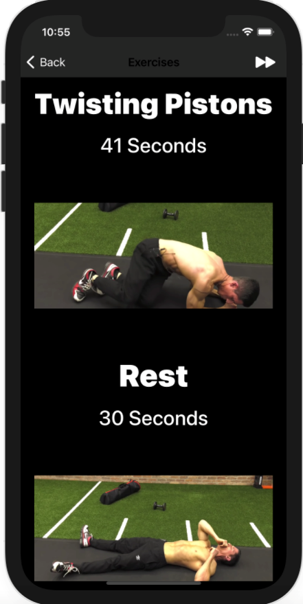

# 6-Pack Abs
An iOS mobile application that conveniently, through auditory cues, guides users through an abdominal workout routine.

Sample Images:
<table>
    <tr>
        <td></td>
        <td></td>
    </tr>
    <tr>
        <td></td>
        <td></td>
    </tr>
</table>

This app was developed fully in Swift. I utilized UITableView to display the exercises while following the model-view-controller design pattern.

Credits to [ATHLEAN-X](https://www.youtube.com/c/athleanx) for workout material.